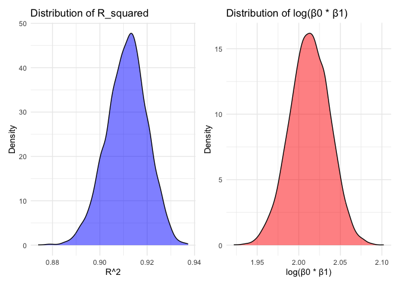

p8105_hw6_jz3900
================
ELisajava
2024-12-03

## Load Necessary Libraries and Set Seed

``` r
library(tidyverse)
```

    ## ── Attaching core tidyverse packages ──────────────────────── tidyverse 2.0.0 ──
    ## ✔ dplyr     1.1.4     ✔ readr     2.1.5
    ## ✔ forcats   1.0.0     ✔ stringr   1.5.1
    ## ✔ ggplot2   3.5.1     ✔ tibble    3.2.1
    ## ✔ lubridate 1.9.3     ✔ tidyr     1.3.1
    ## ✔ purrr     1.0.2     
    ## ── Conflicts ────────────────────────────────────────── tidyverse_conflicts() ──
    ## ✖ dplyr::filter() masks stats::filter()
    ## ✖ dplyr::lag()    masks stats::lag()
    ## ℹ Use the conflicted package (<http://conflicted.r-lib.org/>) to force all conflicts to become errors

``` r
library(broom)
library(patchwork)
library(modelr)
```

    ## 
    ## Attaching package: 'modelr'
    ## 
    ## The following object is masked from 'package:broom':
    ## 
    ##     bootstrap

``` r
library(forcats)
library(janitor)
```

    ## 
    ## Attaching package: 'janitor'
    ## 
    ## The following objects are masked from 'package:stats':
    ## 
    ##     chisq.test, fisher.test

``` r
library(mgcv)
```

    ## Loading required package: nlme
    ## 
    ## Attaching package: 'nlme'
    ## 
    ## The following object is masked from 'package:dplyr':
    ## 
    ##     collapse
    ## 
    ## This is mgcv 1.9-1. For overview type 'help("mgcv-package")'.

``` r
set.seed(1)
theme_set(theme_minimal() + theme(legend.position = "bottom"))
```

# Problem 1

## Import the data

``` r
weather_df = 
  rnoaa::meteo_pull_monitors(
    c("USW00094728"),
    var = c("PRCP", "TMIN", "TMAX"), 
    date_min = "2017-01-01",
    date_max = "2017-12-31")  |> 
  mutate(
    name = recode(id, USW00094728 = "CentralPark_NY"),
    tmin = tmin / 10,
    tmax = tmax / 10)  |> 
  select(name, id, everything())
```

    ## using cached file: /Users/java/Library/Caches/org.R-project.R/R/rnoaa/noaa_ghcnd/USW00094728.dly

    ## date created (size, mb): 2024-12-02 22:27:58.304791 (8.667)

    ## file min/max dates: 1869-01-01 / 2024-11-30

## Bootstrap procedure with `modelr::bootstrap`.

``` r
boot_results = weather_df  |> 
  modelr::bootstrap(n = 5000)  |> 
  mutate(
    model = map(strap, \(df) lm(tmax ~ tmin, data = df)),  
    glance_results = map(model, broom::glance),           
    tidy_results = map(model, broom::tidy)                
  )


final_results = boot_results |> 
  mutate(
    r_squared = map_dbl(glance_results, "r.squared"),  
    tidy_df = map(tidy_results, \(df) df |> 
                    select(term, estimate) |>         
                    pivot_wider(names_from = term, values_from = estimate) |> 
                    mutate(log_beta = log(`(Intercept)`) + log(tmin))) 
  ) |> 
  select(-strap, -model, -glance_results, -tidy_results) |> 
  unnest(tidy_df)  
```

## Draw the Distribution Plots for the estimates $\hat{r}^2$ and $log(\hat{\beta}_0 * \hat{\beta}_1)$.

``` r
plot_1 = ggplot(final_results, aes(x = r_squared)) +
  geom_density(fill = "blue", alpha = 0.5) +
  labs(title = "Distribution of R_squared", x = "R^2", y = "Density") +
  theme_minimal()

plot_2 = ggplot(final_results, aes(x = log_beta)) +
  geom_density(fill = "red", alpha = 0.5) +
  labs(title = "Distribution of log(β0 * β1)", x = "log(β0 * β1)", y = "Density") +
  theme_minimal()

plot_1 + plot_2
```

<!-- -->

**Description**:

Based on the plots, it is evident that both estimates approximate a
normal distribution. The left-hand plot illustrates the distribution of
$\hat{r} ^2$, which is primarily concentrated within the range of 0.88
to 0.94 and exhibits a symmetric, unimodal pattern. Similarly, the
right-hand plot displays the distribution of
$\log(\hat{\beta}_0 \cdot \hat{\beta}_1)$, concentrated between 1.95 and
2.10, also showing a symmetric, unimodal shape. These patterns indicate
that the estimates are precise and consistent.

To determine the 95% confidence intervals for $\hat{r}^2$ and
$\log(\hat{\beta}_0 \cdot \hat{\beta}_1)$, use the 2.5th and 97.5th
percentiles derived from the 5000 bootstrap samples.

``` r
ci_results = final_results |> 
  reframe(
    r_squared_ci = quantile(r_squared, c(0.025, 0.975)),
    log_beta_ci = quantile(log_beta, c(0.025, 0.975))
  )

cat("95% Confidence Interval for R^2:", ci_results$r_squared_ci, "\n")
```

    ## 95% Confidence Interval for R^2: 0.8936684 0.927106

``` r
cat("95% Confidence Interval for log(beta0 * beta1):", ci_results$log_beta_ci, "\n")
```

    ## 95% Confidence Interval for log(beta0 * beta1): 1.964949 2.058887

95% confidence interval for r^2 is (0.894, 0.927). 95% confidence
interval for log (β0⋅β1) is (1.965, 2.059).

# Problem 2

## Import and organize data

``` r
homicide_data = read_csv("data/homicide-data.csv") |>
  janitor::clean_names() |> 
  mutate(city_state = paste(city, state, sep = ", "),
         resolved = ifelse(disposition == "Closed by arrest", 1, 0),
         victim_race = str_to_lower(victim_race),
         victim_age_clean = as.numeric(gsub("[^0-9]", "", victim_age))) |> 
  filter(
    !city_state %in% c("Dallas, TX", "Phoenix, AZ", "Kansas City, MO", "Tulsa, AL"),
    victim_race %in% c("white", "black")
  ) |> 
  mutate(victim_age = victim_age_clean) |> 
  select(-victim_age_clean)  
```

    ## Rows: 52179 Columns: 12
    ## ── Column specification ────────────────────────────────────────────────────────
    ## Delimiter: ","
    ## chr (9): uid, victim_last, victim_first, victim_race, victim_age, victim_sex...
    ## dbl (3): reported_date, lat, lon
    ## 
    ## ℹ Use `spec()` to retrieve the full column specification for this data.
    ## ℹ Specify the column types or set `show_col_types = FALSE` to quiet this message.

## Run Logistic Regression Analysis for Solving Homicides in Baltimore, MD

``` r
baltimore_data = homicide_data |> 
  filter(city_state == "Baltimore, MD")

baltimore_model = glm(resolved ~ victim_age + victim_sex + victim_race, 
                       data = baltimore_data, family = binomial())

baltimore_results = broom::tidy(baltimore_model, conf.int = TRUE, exponentiate = TRUE)

baltimore_or = baltimore_results |> 
  filter(term == "victim_sexMale") |> 
  select(term, estimate, conf.low, conf.high) |> 
  rename(
    `Comparison` = term,
    `Adjusted Odds Ratio` = estimate,
    `Lower 95% CI` = conf.low,
    `Upper 95% CI` = conf.high
  )

baltimore_or |> 
  knitr::kable(caption = "Adjusted Odds Ratio for Male vs Female Victims (Baltimore)") 
```

| Comparison     | Adjusted Odds Ratio | Lower 95% CI | Upper 95% CI |
|:---------------|--------------------:|-------------:|-------------:|
| victim_sexMale |           0.4255117 |    0.3241908 |    0.5575508 |

Adjusted Odds Ratio for Male vs Female Victims (Baltimore)

## Estimation and Presentation of Adjusted Odds Ratios for Male vs Female Victims by City

``` r
city_results = homicide_data |> 
  group_by(city) |> 
  nest() |> 
  mutate(
    models = map(data, \(df) glm(resolved ~ victim_age + victim_sex + victim_race, 
                             data = df, family = binomial())),
    tidy_results = map(models, \(model) broom::tidy(model, conf.int = TRUE, exponentiate = TRUE))
  ) |> 
  unnest(tidy_results) |> 
  filter(term == "victim_sexMale") |> 
  select(city, estimate, conf.low, conf.high) 
```

    ## Warning: There were 45 warnings in `mutate()`.
    ## The first warning was:
    ## ℹ In argument: `tidy_results = map(...)`.
    ## ℹ In group 1: `city = "Albuquerque"`.
    ## Caused by warning:
    ## ! glm.fit: fitted probabilities numerically 0 or 1 occurred
    ## ℹ Run `dplyr::last_dplyr_warnings()` to see the 44 remaining warnings.

``` r
city_results |> 
  knitr::kable(
    col.names = c(
      "City", 
      "Adjusted Odds Ratio", 
      "Lower 95% CI", 
      "Upper 95% CI"
    ),
    caption = "Adjusted Odds Ratio for Male vs Female Victims by City"
  )
```

| City           | Adjusted Odds Ratio | Lower 95% CI | Upper 95% CI |
|:---------------|--------------------:|-------------:|-------------:|
| Albuquerque    |           1.7674995 |    0.8247081 |    3.7618600 |
| Atlanta        |           1.0000771 |    0.6803477 |    1.4582575 |
| Baltimore      |           0.4255117 |    0.3241908 |    0.5575508 |
| Baton Rouge    |           0.3814393 |    0.2043481 |    0.6836343 |
| Birmingham     |           0.8700153 |    0.5713814 |    1.3138409 |
| Boston         |           0.6739912 |    0.3534469 |    1.2768225 |
| Buffalo        |           0.5205704 |    0.2884416 |    0.9358300 |
| Charlotte      |           0.8838976 |    0.5507440 |    1.3905954 |
| Chicago        |           0.4100982 |    0.3361233 |    0.5008546 |
| Cincinnati     |           0.3998277 |    0.2313767 |    0.6670456 |
| Columbus       |           0.5324845 |    0.3770457 |    0.7479124 |
| Denver         |           0.4790620 |    0.2327380 |    0.9624974 |
| Detroit        |           0.5823472 |    0.4619454 |    0.7335458 |
| Durham         |           0.8123514 |    0.3824420 |    1.6580169 |
| Fort Worth     |           0.6689803 |    0.3935128 |    1.1211603 |
| Fresno         |           1.3351647 |    0.5672553 |    3.0475080 |
| Houston        |           0.7110264 |    0.5569844 |    0.9057376 |
| Indianapolis   |           0.9187284 |    0.6784616 |    1.2413059 |
| Jacksonville   |           0.7198144 |    0.5359236 |    0.9650986 |
| Las Vegas      |           0.8373078 |    0.6058830 |    1.1510854 |
| Long Beach     |           0.4102163 |    0.1427304 |    1.0241775 |
| Los Angeles    |           0.6618816 |    0.4565014 |    0.9541036 |
| Louisville     |           0.4905546 |    0.3014879 |    0.7836391 |
| Memphis        |           0.7232194 |    0.5261210 |    0.9835973 |
| Miami          |           0.5152379 |    0.3040214 |    0.8734480 |
| Milwaukee      |           0.7271327 |    0.4951325 |    1.0542297 |
| Minneapolis    |           0.9469587 |    0.4759016 |    1.8809745 |
| Nashville      |           1.0342379 |    0.6807452 |    1.5559966 |
| New Orleans    |           0.5849373 |    0.4218807 |    0.8121787 |
| New York       |           0.2623978 |    0.1327512 |    0.4850117 |
| Oakland        |           0.5630819 |    0.3637421 |    0.8671086 |
| Oklahoma City  |           0.9740747 |    0.6228507 |    1.5199721 |
| Omaha          |           0.3824861 |    0.1988357 |    0.7109316 |
| Philadelphia   |           0.4962756 |    0.3760120 |    0.6498797 |
| Pittsburgh     |           0.4307528 |    0.2626022 |    0.6955518 |
| Richmond       |           1.0060520 |    0.4834671 |    1.9936248 |
| San Antonio    |           0.7046200 |    0.3928179 |    1.2382509 |
| Sacramento     |           0.6688418 |    0.3262733 |    1.3143888 |
| Savannah       |           0.8669817 |    0.4185827 |    1.7802453 |
| San Bernardino |           0.5003444 |    0.1655367 |    1.4623977 |
| San Diego      |           0.4130248 |    0.1913527 |    0.8301847 |
| San Francisco  |           0.6075362 |    0.3116925 |    1.1551470 |
| St. Louis      |           0.7031665 |    0.5298505 |    0.9319005 |
| Stockton       |           1.3517273 |    0.6256427 |    2.9941299 |
| Tampa          |           0.8077029 |    0.3395253 |    1.8598834 |
| Tulsa          |           0.9757694 |    0.6090664 |    1.5439356 |
| Washington     |           0.6901713 |    0.4653608 |    1.0122516 |

Adjusted Odds Ratio for Male vs Female Victims by City

## Visualization of Estimated Odds Ratios and Confidence Intervals by City

``` r
city_results |> 
  ggplot(aes(y = reorder(city, estimate), x = estimate)) + 
    geom_point(color = "blue") +
    geom_errorbarh(aes(xmin = conf.low, xmax = conf.high), height = 0.25) +  
    labs(
      title = "Adjusted Odds Ratios for Solving Homicides (Male vs Female Victims)",
      x = "Adjusted Odds Ratio (95% CI)",
      y = "City"
    )
```

<!-- -->

**Description**:

1.  **Cities with OR \< 1:**  
    Male victims are less likely to have their cases resolved in cities
    where the odds ratio (OR) is below 1. Notable examples include New
    York and Baton Rouge, which appear near the lower end of the plot.

2.  **Cities with OR \> 1:**  
    A limited number of cities, such as Albuquerque and Stockton,
    exhibit ORs greater than 1. This indicates that male victims in
    these cities may have a higher likelihood of their cases being
    resolved compared to female victims. However, the wide confidence
    intervals (CIs) associated with these ORs highlight significant
    uncertainty in the estimates.

3.  **Cities with Wide CIs:**  
    Cities like Albuquerque, NM, and Stockton, CA, display notably wide
    confidence intervals, which reflect either high variability or
    insufficient data in these locations. Such uncertainty makes it
    challenging to draw definitive conclusions about the ORs in these
    cities.

4.  **Statistical Significance:**  
    Cities where the confidence intervals do not include OR = 1
    demonstrate statistically significant differences (e.g., New York).
    Conversely, cities with confidence intervals that overlap OR = 1 are
    not statistically significant, indicating no definitive evidence of
    a difference in resolution rates between male and female victims.

# Problem 3

## Import and Organize the Data

``` r
birthweight_data=read_csv(
  "./data/birthweight.csv",
  na = c("NA", ".", "")) |> 
  janitor::clean_names() |> 
  mutate(
    babysex = factor(babysex, levels = c(1, 2), labels = c("Male", "Female")),
    frace = factor(frace, levels = c(1, 2, 3, 4, 8, 9), labels = c("White", "Black", "Asian", "Puerto Rican", "Other", "Unknown")),
    mrace = factor(mrace, levels = c(1, 2, 3, 4, 8), labels = c("White", "Black", "Asian", "Puerto Rican", "Other")),
    malform = factor(malform, levels = c(0, 1), labels = c("Absent", "Present"))
  ) |> 
  drop_na()
```

    ## Rows: 4342 Columns: 20
    ## ── Column specification ────────────────────────────────────────────────────────
    ## Delimiter: ","
    ## dbl (20): babysex, bhead, blength, bwt, delwt, fincome, frace, gaweeks, malf...
    ## 
    ## ℹ Use `spec()` to retrieve the full column specification for this data.
    ## ℹ Specify the column types or set `show_col_types = FALSE` to quiet this message.

## Proposed Linear Regression Model for Predicting Birthweight Using Key Predictors

``` r
lm_model = lm(
  bwt ~ delwt + gaweeks+ppbmi+momage+smoken, 
  data = birthweight_data)

summary(lm_model)
```

    ## 
    ## Call:
    ## lm(formula = bwt ~ delwt + gaweeks + ppbmi + momage + smoken, 
    ##     data = birthweight_data)
    ## 
    ## Residuals:
    ##      Min       1Q   Median       3Q      Max 
    ## -1802.79  -271.27     5.52   283.19  1509.10 
    ## 
    ## Coefficients:
    ##             Estimate Std. Error t value Pr(>|t|)    
    ## (Intercept) -21.9439    96.7989  -0.227    0.821    
    ## delwt         8.9062     0.4394  20.271  < 2e-16 ***
    ## gaweeks      59.0073     2.1555  27.375  < 2e-16 ***
    ## ppbmi       -32.3195     3.0449 -10.614  < 2e-16 ***
    ## momage       11.9682     1.7430   6.866 7.52e-12 ***
    ## smoken       -7.8121     0.9059  -8.624  < 2e-16 ***
    ## ---
    ## Signif. codes:  0 '***' 0.001 '**' 0.01 '*' 0.05 '.' 0.1 ' ' 1
    ## 
    ## Residual standard error: 439.9 on 4336 degrees of freedom
    ## Multiple R-squared:  0.263,  Adjusted R-squared:  0.2621 
    ## F-statistic: 309.4 on 5 and 4336 DF,  p-value: < 2.2e-16

## Residuals vs. Fitted Values Analysis for Birthweight Model

``` r
birthweight_lm = birthweight_data |> 
  add_predictions(lm_model) |> 
  add_residuals(lm_model)

ggplot(birthweight_lm, aes(x = pred, y = resid)) +
  geom_point() +
  geom_smooth(method = "lm", color = "red") +
  labs(title = "Residuals vs Fitted Values", x = "Fitted values", y = "Residuals")
```

    ## `geom_smooth()` using formula = 'y ~ x'

<!-- -->

**Description**:

The residuals vs. fitted values plot reveals the following:  
1. **Non-linearity:** The curvature of the LOESS line indicates that the
model does not fully capture the underlying relationship between the
predictors and birth weight.  
2. **Heteroscedasticity:** An increase in residual variance at lower
fitted values suggests a violation of the assumption of constant
variance.  
3. **Outliers:** The presence of extreme residuals indicates potential
influential points that may impact the model’s performance.  
\## Monte Carlo Cross-Validation and RMSE Distribution for Birthweight
Models

``` r
cv_df = 
  crossv_mc(birthweight_data, 100) |> 
  mutate(
    train = map(train, as_tibble), 
    test = map(test, as_tibble)  
  )

cv_df = cv_df |> 
  mutate(
    lm_model = map(train, \(df) lm(bwt ~ delwt + gaweeks+ppbmi+momage+smoken, 
                                   data = df)),
    model_length_ga = map(train, \(df) lm(bwt ~ blength + gaweeks, data = df)),
    model_interaction = map(train, \(df) lm(bwt ~ bhead * blength * babysex, data = df))
  ) |> 
  mutate(
    rmse_lm_model = map2_dbl(lm_model, test, \(mod, df) rmse(model = mod, data = df)),
    rmse_length_ga = map2_dbl(model_length_ga, test, \(mod, df) rmse(model = mod, data = df)),
    rmse_interaction = map2_dbl(model_interaction, test, \(mod, df) rmse(model = mod, data = df))
  )

rmse_results = cv_df |> 
  select(starts_with("rmse")) |> 
  pivot_longer(
    cols = everything(),
    names_to = "model", 
    values_to = "rmse",
    names_prefix = "rmse_"
  ) |> 
  mutate(model = fct_inorder(model))

rmse_results |> 
  ggplot(aes(x = model, y = rmse)) + 
  geom_violin(fill = "lightgreen", alpha = 0.7) +
  theme_minimal() +
  labs(
    title = "Cross-validated RMSE for Different Models",
    x = "Model",
    y = "RMSE"
  ) +
  theme(
    plot.title = element_text(hjust = 0.5)  # Center the title
  )
```

<!-- -->

**Description**:

The interaction model demonstrates superior performance, offering both
higher accuracy (as evidenced by lower RMSE) and greater consistency
(reflected in a narrower interquartile range).  
The proposed model strikes a balance between model complexity and
predictive performance, making it a well-rounded option.

In contrast, the main effects model performs the least effectively,
characterized by higher RMSE and greater variability.
